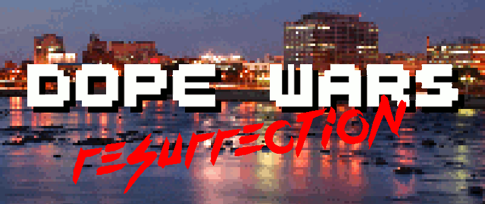

Dope Wars: Resurrection
==

Around 2001 I started work on my first large scale programming project: a fully graphical version of the ever popular ["Dope Wars"](https://en.wikipedia.org/wiki/Drugwars). At the time, everyone was playing this on their Ti calculators, and it seemed like a relatively easy project to take on as it didn't require AI, physics, or any of the other tricky bits of game development.

I recently found a backup copy of the source code and art files for the game in my attic; and since it was right around the 15th anniversary of the game's release, I thought it would be interesting to see if I could get the game running and perhaps even improve upon the original a bit.

_Naturally_, that has turned into nearly a complete rewrite of the game.

Development
==

I was still using MS-DOS as my primary operating system in 2001, and as such the game was developed in QBasic 4.5, which was the only development environment the OS shipped with.

The project is currently being moved over to [QB64](https://en.wikipedia.org/wiki/QB64), which adds many new features as well as the ability to compile native binaries for modern operating systems.

I've also setup a QB45 branch which retains the original source code, suitable for use with QB 4.5 under [DOSBox](https://en.wikipedia.org/wiki/DOSBox). This is intended as a historical reference point, and I won't be making any changes to it unless some large bug/issue is uncovered.

License
==

The software is distributed under a BSD 3 clause license in the hope that it
will be useful, but WITHOUT ANY WARRANTY; without even the implied warranty of
MERCHANTABILITY or FITNESS FOR A PARTICULAR PURPOSE.

For details, see the file "LICENSE" in the source directory.

For details, see: http://creativecommons.org/licenses/by-sa/3.0/
